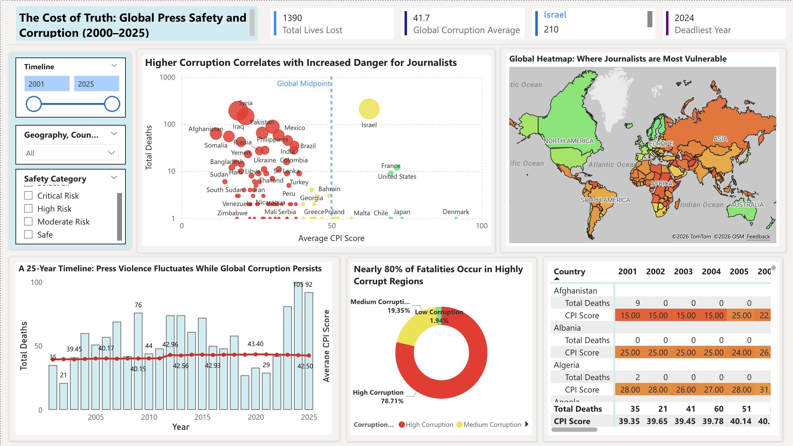
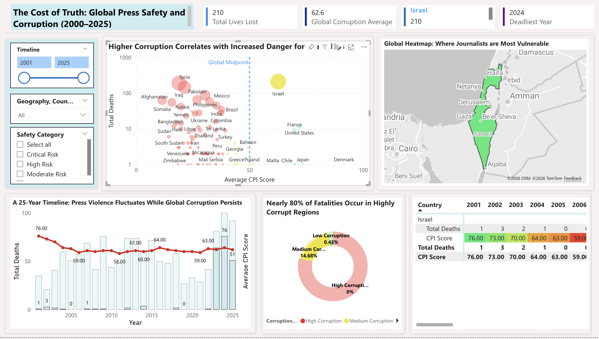
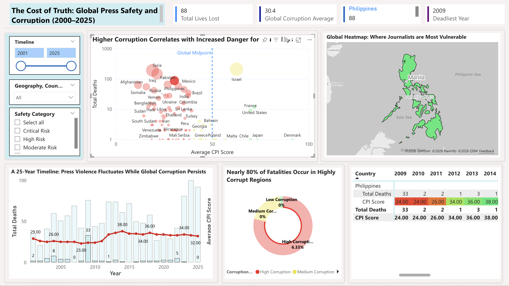
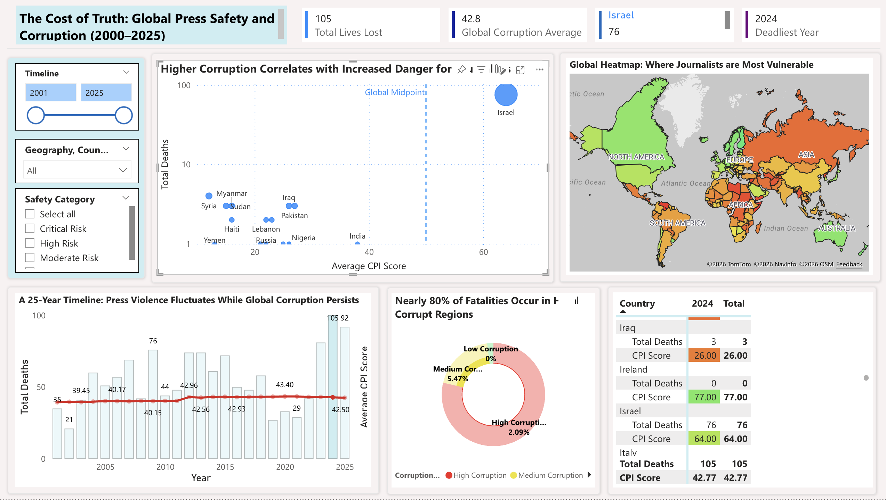

# Analytical Insights: The Cost of Truth (2001–2025)

## 1. Objective of the Analysis

This report looks at 25 years of data (2001–2025) to answer a specific question: *Does a country's level of public sector corruption affect how safe it is for journalists?* Using the interactive Power BI dashboard, we explored timelines, regions, and safety ratings to find the patterns hidden in the numbers. This document highlights the biggest takeaways, moving beyond the raw data to show the real human cost of corruption.

---

## 2. Global Baseline Findings

### 2.1 The Numbers at a Glance
* **Total lives lost (2001–2025):** 1,390
* **Global average corruption score (CPI):** 41.7 out of 100
* **Share of deaths in highly corrupt countries:** ~80%

### 2.2 Key Observations
* The vast majority of journalist deaths happened in countries with severe government corruption.
* Over the last 25 years, the global average for corruption hardly changed at all. 
* However, the number of journalists killed went up and down drastically from year to year.

### 2.3 The "Peacetime Paradox"
The most important finding of this project is the **"Peacetime Paradox."** The data clearly shows that nearly 80% of the danger to journalists comes from corrupt systems, not just active war zones. 

While corruption is a constant, everyday problem, sudden crises - like an election, a cartel war, or a regime change - act as the spark that causes deaths to spike. This proves that broken systems and bad governments create deadly environments long before a war is ever declared.

---

## 3. Breaking Down the Data

To see how these global trends play out in real life, we used the dashboard to zoom in on specific regions and timeframes.

### 3.1 Danger Beyond the Battlefield (Asia Pacific)

* **Scope of Analysis:** Looking only at the Asia Pacific region.
* **Data Findings:** 336 lives were lost here, with the Philippines accounting for 88 deaths (peaking in 2009).
* **Analytical Interpretation:** People often assume journalists are only in danger in the Middle East. The data from the Asia Pacific region proves that physical distance from global wars does not keep people safe if their own public institutions are deeply corrupt. 

### 3.2 How Wars Shift the Map (2012–2015)

* **Scope of Analysis:** Looking only at the years 2012 to 2015.
* **Data Findings:** 281 lives were lost globally, with Syria accounting for 92 of those deaths.
* **Analytical Interpretation:** When a massive conflict breaks out, the danger on the global map shrinks and centers directly on that war zone. During this four-year window, the danger was heavily pulled toward the Syrian civil war. 

### 3.3 The Exception to the Rule (Israel)

* **Scope of Analysis:** Isolating the data for Israel.
* **Data Findings:** 210 lives lost, making 2024 the deadliest year.
* **Analytical Interpretation:** In data, the exceptions are just as important as the rules. Israel has a decent corruption score (62.6), yet it had a massive spike in deaths. This shows that while corruption is the main driver of danger globally, a sudden, explosive war overrides everything else and can cause record-breaking fatalities.

### 3.4 The Power of Clean Governments (The "Safe" Category)

* **Scope of Analysis:** Looking only at countries rated "Safe" (low corruption).
* **Data Findings:** 0 lives lost. 
* **Analytical Interpretation:** This is perhaps the most powerful number in the entire dashboard: **zero**. When we look strictly at countries with clean, transparent public sectors, the danger to journalists virtually disappears. This is clear proof that strong, honest institutions protect press freedom.

### 3.5 A Closer Look at the Paradox (The Philippines)

* **Scope of Analysis:** Isolating the data for the Philippines.
* **Data Findings:** 88 lives lost, with a massive spike in a single year (2009).
* **Analytical Interpretation:** Instead of a steady number of deaths each year, the Philippines saw a single, catastrophic event in 2009. This perfectly illustrates the "Peacetime Paradox." Without a declared war, danger in corrupt countries usually comes from sudden, targeted attacks rather than daily crossfire.

### 3.6 The Deadliest Era is Now (2024–2025)

* **Scope of Analysis:** Looking at the most recent years (2024–2025).
* **Data Findings:** 2024 was the deadliest year in recorded history with 105 deaths. 
* **Analytical Interpretation:** This issue is not stuck in the past; it is currently peaking. A single modern regional conflict drove the global death toll to its highest point in 25 years. 

---

## 4. Final Takeaways

Across 25 years and 1,390 lost lives, the numbers tell a clear and simple story: **transparency saves lives.**

1. **Corruption is the Fuel:** Countries with severe corruption account for the vast majority of journalist deaths. 
2. **The Illusion of Peace:** A country does not need to be fighting a war to be deadly. A broken justice system is dangerous enough on its own.
3. **Honesty Protects:** In countries where governments are held accountable and corruption is low, journalists are overwhelmingly safe.

The data proves that protecting the press requires more than just stopping wars—it requires fixing broken, corrupt systems from the inside out.
