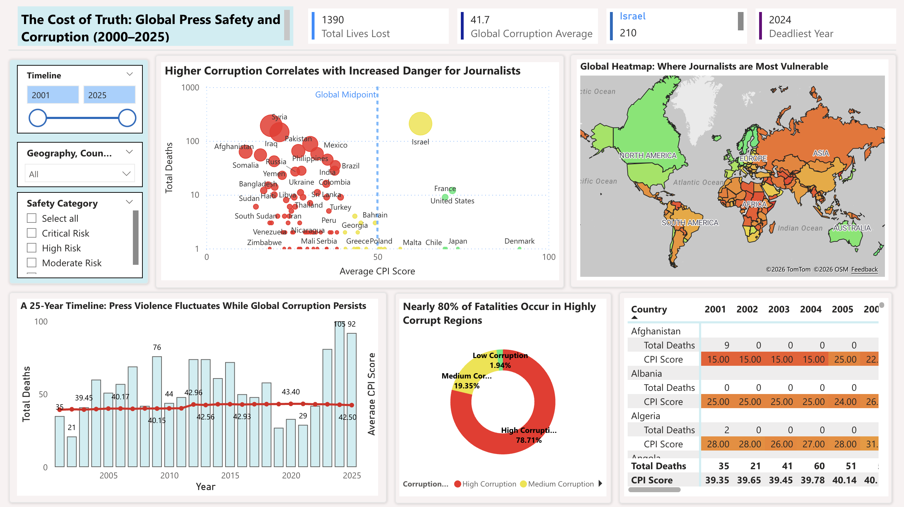
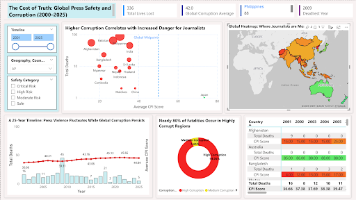
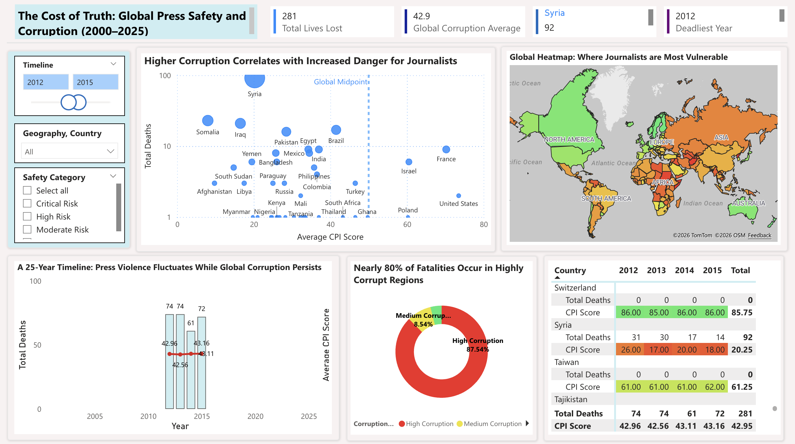
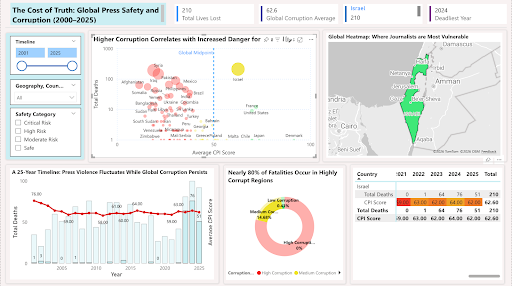
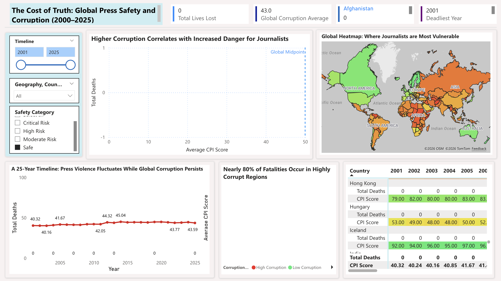
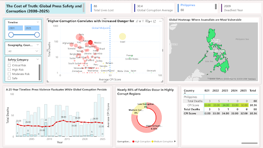

# Analytical Insights: The Cost of Truth (2001–2025)

## 1. Objective of the Analysis
This analysis examines 25 years (2001–2025) of journalist fatality data alongside Corruption Perceptions Index (CPI) scores. The objective is to evaluate whether patterns exist between institutional integrity (as measured by CPI) and journalist safety outcomes.

The findings presented below are based on interactive Power BI dashboard exploration using timeline, geography, and safety category filters. This document focuses on identifying statistical associations. It does not assume direct causation.

## 2. Global Baseline Findings

**2.1 Key Metrics Summary**
* Total journalist fatalities (2001–2025): 1,390
* Global average CPI score: 41.7
* Approximate share of fatalities in high-corruption countries: ~80%

**2.2 Data Findings**
* A large majority of journalist fatalities occurred in countries classified under lower CPI score ranges.
* The global CPI average remained relatively stable over the 25-year period.
* Fatality counts fluctuated significantly year by year.

**2.3 Analytical Interpretation**
The data shows a strong statistical association between lower CPI scores and higher journalist fatality counts. While corruption levels appear structurally stable over time, journalist fatalities are event-driven and fluctuate sharply. This suggests:
* Institutional weakness may create a persistent risk environment.
* Acute geopolitical or national events act as amplifying factors that temporarily increase fatality counts.

---

## 3. Segment Analysis
To better understand global patterns, dashboard filters were applied to isolate specific regions, timeframes, and categories.

### 3.1 Regional Analysis – Asia Pacific

**Scope of Analysis**
* Geography filter set to Asia Pacific.

**Data Findings**
* 336 total fatalities recorded in the region.
* Regional CPI average: 42.0
* The Philippines accounts for 88 deaths.
* 2009 recorded as the deadliest year in that country.

**Analytical Interpretation**
The Asia Pacific region demonstrates measurable vulnerability in journalist safety outcomes. Fatality concentration within specific countries indicates that localized national events significantly influence regional totals. This finding shows that risk distribution is geographically diverse and not limited to traditionally high-conflict regions.

### 3.2 Timeframe Analysis – 2012–2015

**Scope of Analysis**
* Timeline filter set to 2012–2015.

**Data Findings**
* 281 global fatalities during this four-year period.
* Syria recorded 92 fatalities.
* 2012 marked its highest annual count.

**Analytical Interpretation**
During this timeframe, journalist fatalities became geographically concentrated in areas experiencing intense conflict. The data illustrates how short-term geopolitical instability can substantially shift global fatality distribution within a limited period.

### 3.3 Country-Level Analysis – Israel

**Scope of Analysis**
* Country-level isolation of Israel.

**Data Findings**
* 210 total fatalities recorded.
* CPI average under this filter: 62.6
* 2024 recorded as the deadliest year.

**Analytical Interpretation**
Despite maintaining a comparatively higher CPI score, fatality counts increased sharply during specific conflict periods. This case represents a statistical outlier within the broader trend. The pattern indicates that large-scale geopolitical events can elevate journalist risk independently of long-term institutional corruption levels.

### 3.4 Category-Based Analysis – Safe Classification

**Scope of Analysis**
* Safety Category filter set to “Safe”.

**Data Findings**
* 0 fatalities recorded.
* CPI average: 43.0

**Analytical Interpretation**
When restricted to countries categorized as “Safe,” journalist fatalities are not observed within this subset. This finding is consistent with the broader pattern linking stronger institutional conditions to improved press safety outcomes.

### 3.5 Country-Level Micro Analysis – The Philippines

**Scope of Analysis**
* Country-level isolation of the Philippines.

**Data Findings**
* 88 total fatalities recorded.
* Significant spike observed in 2009.

**Analytical Interpretation**
Fatality distribution in this case appears concentrated around a specific year rather than sustained over multiple years. This suggests that isolated national events can produce sharp increases in journalist risk, even outside prolonged armed conflict environments.

### 3.6 Recent Global Peaks (2024–2025)

**Scope of Analysis**
* Timeline filter set to 2024–2025.

**Data Findings**
* 2024 recorded 105 global fatalities (highest in dataset).
* 76 fatalities occurred in Israel during 2024.
* 2025 recorded 92 fatalities globally.

**Analytical Interpretation**
Recent peaks significantly influenced the overall 25-year trend. The data shows that concentrated regional events can substantially affect global annual totals. This reinforces the importance of distinguishing between long-term structural risk patterns and short-term crisis-driven spikes.

---

## 4. Overall Analytical Summary
Across the 25-year dataset, the following patterns emerge:
* Lower CPI scores are statistically associated with higher journalist fatality counts.
* Institutional corruption appears to function as a structural risk factor.
* Acute geopolitical conflicts act as short-term amplifiers.
* Fatality trends are shaped by both systemic conditions and event-driven disruptions.

This analysis highlights measurable associations within the dataset and provides a structured foundation for further statistical modeling or hypothesis testing.
